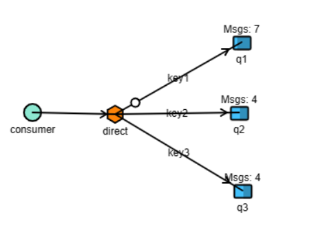
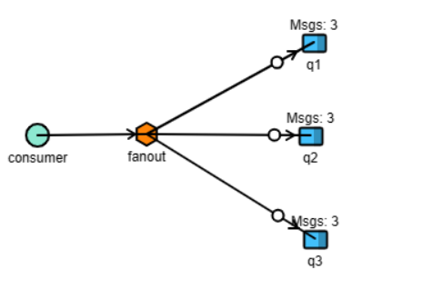
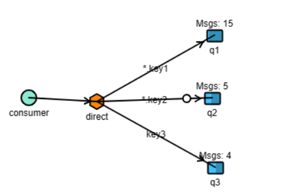

# RabbitMQ

Exemplo básico de um Publisher e um Consumer.

## Exchanges

Funciona como um middleware entre o producer e a queue.


#### Direct

A exchange "direct" roteia mensagens para as filas cujas chaves de roteamento coincidem exatamente com a chave de roteamento especificada pela mensagem. Ela trabalha com o conceito de **um-para-um**. 

```cs
    var channel = // Obtenha o canal do RabbitMQ
    var exchangeName = "minha_exchange";
    var queueName = "minha_fila";
    var routingKey = "minha_chave_de_roteamento";

    // Declaração da exchange
    channel.ExchangeDeclare(exchange: exchangeName, type: ExchangeType.Direct);

    // Declaração da fila
    channel.QueueDeclare(queue: queueName, durable: false, exclusive: false, autoDelete: false, arguments: null);

    // Vinculação da fila à exchange com uma chave de roteamento
    channel.QueueBind(queue: queueName, exchange: exchangeName, routingKey: routingKey);
```

No exemplo abaixo foi específico o Routing Key **key1**



#### Fanout

É um tipo de exchange que roteia mensagens para todas as filas associadas a ela. Ao contrário das exchanges direct e topic, a fanout não utiliza chaves de roteamento. Ela simplesmente envia a mensagem para todas as filas vinculadas a ela, independentemente da chave de roteamento da mensagem.

```cs
    var channel = // Obtenha o canal do RabbitMQ
    var exchangeName = "minha_exchange_fanout";
    var queueName = "minha_fila";

    // Declaração da exchange do tipo "fanout"
    channel.ExchangeDeclare(exchange: exchangeName, type: ExchangeType.Fanout);

    // Declaração da fila
    channel.QueueDeclare(queue: queueName, durable: false, exclusive: false, autoDelete: false, arguments: null);

    // Vinculação da fila à exchange
    channel.QueueBind(queue: queueName, exchange: exchangeName, routingKey: "");
```

No exemplo abaixo a mensagem é enviada para todas as queues associadas a essa enchange.



#### Topic

É um tipo mais flexível de exchange em comparação com a exchange "direct". Enquanto a exchange "direct" realiza correspondência exata entre a chave de roteamento da mensagem e a chave de roteamento da fila, a exchange "topic" permite padrões de correspondência mais avançados, usando curingas (wildcards) nos padrões de chave de roteamento.

```cs
    var channel = // Obtenha o canal do RabbitMQ
    var exchangeName = "minha_exchange_topic";
    var queueName = "minha_fila";
    var routingKeyPattern = "minha.*.chave.*.roteamento";

    // Declaração da exchange do tipo "topic"
    channel.ExchangeDeclare(exchange: exchangeName, type: ExchangeType.Topic);

    // Declaração da fila
    channel.QueueDeclare(queue: queueName, durable: false, exclusive: false, autoDelete: false, arguments: null);

    // Vinculação da fila à exchange com um padrão de chave de roteamento
    channel.QueueBind(queue: queueName, exchange: exchangeName, routingKey: routingKeyPattern);
```

No exemplo abaixo eu crio Routing Keys com padrões ***.key1** (wildcard) e o topic consegue redirecionar para a Queue correspondente.



#### Headers


## Producer

Emissor da mensagem


## Consumer

Quem consome a mensagem 


